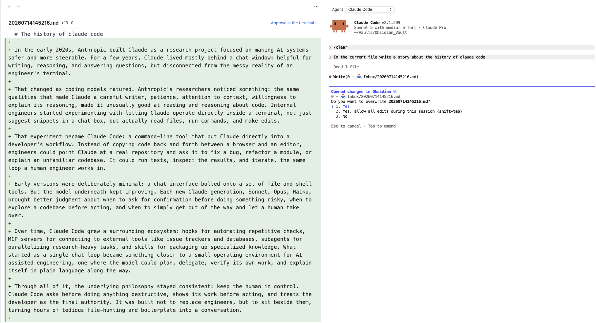

# obsidian-agent-mcp



> Connect Obsidian to coding agents like Claude Code and Codex so they can work with your vault context. The goal is to let LLMs handle the brunt work in maintaining a knowledge base or task manager. (Or both.)
>
> Ships with a **built-in terminal**, so you can run `claude` or `codex` directly inside Obsidian — no other plugins required.

---

## What it does

### Built-in terminal
- Full terminal emulator inside Obsidian, powered by [xterm.js](https://github.com/xtermjs/xterm.js) and a small pseudo-terminal bridge that runs on your system's Python 3 — no native binaries are bundled or compiled.
- **Launches straight into your chosen agent** — Claude Code, or a local model via Ollama — instead of a bare shell prompt. A dropdown at the top of the panel lets you **switch agents on the fly** (or drop to a plain **Terminal** with no agent); switching kills the current session and restarts it with the newly selected option, and remembers your choice as the default.
- Honors your `$SHELL` and starts in the vault root by default.
- Use the ribbon icon or the **"Open Agent Terminal"** command.

### IDE integration (WebSocket)
- Starts a local WebSocket server on `127.0.0.1` (random port, never network-exposed)
- Writes a lock file to `~/.claude/ide/` — Claude Code reads this to auto-discover and connect to Obsidian, the same way it connects to VS Code or other editors. The lock is re-asserted on an interval, so if it ever gets cleaned out from under us the connection self-heals instead of going silently dead until the next reload.
- Streams your active file path and text selection to Claude Code as you navigate
- Adds a **"Send to Claude"** command to explicitly push your current selection as context

### Edit previews (terminal-gated diffs)
When Claude Code is connected as an IDE, it routes file edits through the IDE instead of printing the diff in the terminal. The plugin handles this by:
- Opening a **read-only diff preview** of the proposed change in a side pane — added lines in green, removed lines struck in red.
- Immediately **handing focus back to the terminal**, so you approve or decline right there using Claude's normal `y`/`n` prompt — no mouse, no separate buttons.
- Letting **Claude write the file itself** on accept (the plugin never writes it), which keeps Claude's view of the file in sync and avoids "file content has changed" errors.
- Clearing the preview and refocusing the terminal once you've decided.

### MCP HTTP server
- Runs a second local MCP server on `127.0.0.1:27183`
- Exposes a modern Streamable HTTP endpoint at `/mcp` for Codex
- Preserves the older HTTP/SSE endpoints for Claude Desktop and other legacy MCP clients

### MCP tools exposed

| Tool | Description | Toggle in settings |
|---|---|---|
| `getLatestSelection` | Active file path, cursor position, and selected text (falls back to last-known state when Obsidian loses focus) | Always on |
| `getOpenEditors` | All open markdown tabs with file URI, label, and which is active | Always on |
| `getWorkspaceFolders` | Vault root path | Always on |

---

## Requirements

- **Obsidian** desktop on macOS or Linux. Mobile is not supported; on Windows everything except the built-in terminal works (see [Compatibility](#compatibility)).
- **Python 3** available on your `PATH` (or set an explicit path in settings). It runs a small standard-library pseudo-terminal bridge for the built-in terminal — there are **no pip packages to install**. Use the **Check** button in settings to verify it.
- **The agent CLI(s) you want to use, installed separately on your system** — the plugin *launches* them, it does not bundle them:
  - **Claude Code agent** → install the [`claude` CLI](https://docs.claude.com/en/docs/claude-code). This is the default agent.
  - **Ollama agent (local model)** → install **both** [Ollama](https://ollama.com) **and** the [`claude` CLI](https://docs.claude.com/en/docs/claude-code). This option runs `ollama launch claude`, which is Claude Code pointed at a local model — so it needs *both* installed.
  - Codex (via the MCP server only) → install the `codex` CLI if you use it.

  The terminal launches agents through your interactive login shell, so each CLI must be reachable on the `PATH` your shell config sets up (e.g. what `which claude` / `which ollama` print in a normal terminal).

## Installation

### Option A: Manual install (no build required)

1. Download `main.js`, `manifest.json`, and `styles.css` from the [latest release](../../releases/latest).
2. Create `.obsidian/plugins/agent-mcp/` inside your vault and place all three files there.
3. Go to **Obsidian → Settings → Community plugins** → refresh → toggle **Agent MCP** on.

### Option B: Build from source

```bash
git clone https://github.com/rospaans/obsidian-agent-mcp
cd obsidian-agent-mcp
npm install
cp .env.example .env          # optional: point at your vault's plugin folder
npm run build
```

`npm run build` bundles the whole plugin — including the Python bridge script — into a single `main.js`. If `OBSIDIAN_PLUGIN_DIR` is set in `.env`, the build also deploys `main.js` and `manifest.json` into your vault.

---

## How it's wired up

The plugin runs two local services, both bound to `127.0.0.1`:

| Service | Port | What it does | Used by |
|---|---|---|---|
| **WebSocket IDE server** | OS-assigned (random) | Streams active file + selection, advertises the lock file in `~/.claude/ide/`, and renders edit diffs as terminal-gated previews. Lets Claude Code auto-discover Obsidian as an "IDE". | Claude Code |
| **MCP HTTP server** | `127.0.0.1:27183` | Exposes all tools (`getLatestSelection`, `getOpenEditors`, `getWorkspaceFolders`) over the standard MCP Streamable HTTP transport. | Claude Code, Codex, any MCP client |

Both routes into the same tool registry — adding one tool makes it available everywhere.

**Important**: Claude Code treats IDE connections and MCP servers as separate systems. The IDE connection gives Claude live selection awareness; the MCP server is what exposes our tools to the model. You want **both** registered.

## Usage

### Opening a terminal

1. Enable the plugin.
2. Click the agent ribbon icon, or run **"Open Agent Terminal"** from the command palette.
3. A terminal opens in the right sidebar and **launches directly into your selected agent** (Claude Code by default) — you land in the agent, not a bare shell.
4. Use the **Agent** dropdown at the top of the panel to switch between **Claude Code**, **Ollama**, **Codex**, and a plain **Terminal** (a normal shell with no agent, for running other commands). Switching restarts the session and remembers your choice as the default.
5. Configure the default agent, shell, working directory, and font size under **Settings → Agent MCP**.

### With Claude Code

Register both channels once, then you're done forever.

```bash
# (1) Register our MCP server so Claude can call our tools
claude mcp add --transport http agent-mcp http://127.0.0.1:27183/mcp
```

The IDE connection is automatic — nothing to register. The plugin's built-in terminal exports `CLAUDE_CODE_SSE_PORT`, so Claude Code launched there **auto-connects to Obsidian on startup** (reading the lock file in `~/.claude/ide/` for the auth token), exactly like an IDE-integrated terminal.

Then:

1. Open a terminal inside Obsidian (ribbon icon or command palette) — it launches straight into `claude` and connects to Obsidian automatically.
2. Inside Claude, `/mcp` should list `agent-mcp` as connected.
3. Ask something like *"What file am I in?"* → Claude will call `getLatestSelection`.

> Running `claude` from an **external** terminal instead? It won't have that env var, so run `/ide` inside Claude once and pick **Obsidian** to connect.

Use the command palette command **"Send to Claude"** in Obsidian to explicitly push your current selection as a context mention.

When Claude edits a note, a read-only diff preview opens in Obsidian and focus returns to the terminal — approve or decline with Claude's `y`/`n` prompt as usual.

### With Codex CLI

Codex only needs the MCP server registration:

```bash
codex mcp add agent-mcp --url http://127.0.0.1:27183/mcp
```

Then pick **Codex** from the **Agent** dropdown (or set it as the default agent) — the terminal launches `codex` for you. Run `/mcp` inside Codex to confirm the connection, then ask anything that benefits from vault context. Codex uses the MCP tools only; the live selection/diff-preview IDE features are Claude Code-specific.

### With a local model via Ollama

You can run the **exact same Claude Code experience** against a local model with [Ollama](https://ollama.com). Ollama exposes an Anthropic-compatible endpoint at `http://localhost:11434` and ships an `ollama launch claude` helper that starts Claude Code pointed at a local model. Because it's still Claude Code underneath, the IDE connection, MCP tools, and diff previews all work identically — no extra registration, no proxy.

**Setup:**

1. Install [Ollama](https://ollama.com) **and** the [`claude` CLI](https://docs.claude.com/en/docs/claude-code) (this option runs `ollama launch claude`, so it needs both). Pull a model with a large (64k+) context window and tool-use support — e.g. `ollama pull qwen3.5`. See [Ollama's Claude Code guide](https://docs.ollama.com/integrations/claude-code) for recommended models.
2. In **Settings → Agent MCP → Default agent**, choose **Ollama** and enter your model name (e.g. `qwen3.5`) — or just pick **Ollama** from the **Agent** dropdown at the top of the terminal.
3. Open the Agent Terminal. It now launches `ollama launch claude --model <your-model>` instead of `claude`.
4. As with Claude Code, register the MCP server once so the model can call our tools:

   ```bash
   claude mcp add --transport http agent-mcp http://127.0.0.1:27183/mcp
   ```

The IDE connection is still automatic — Claude Code discovers Obsidian via the lock file exactly as before.

> Prefer to drive it yourself? `ollama launch claude` just sets these and runs Claude Code:
>
> ```bash
> export ANTHROPIC_BASE_URL=http://localhost:11434
> export ANTHROPIC_AUTH_TOKEN=ollama
> export ANTHROPIC_API_KEY=""
> claude --model qwen3.5
> ```

---

## Settings

**Settings → Agent MCP**

- **Default agent** — Claude Code, Ollama (local model), Codex, or a plain Terminal, that a new terminal launches with. Also switchable from the **Agent** dropdown at the top of the terminal (switching there restarts the session and updates this default). See [With a local model via Ollama](#with-a-local-model-via-ollama).
- **Ollama model** — model passed to `ollama launch claude --model <model>` (shown only when the Ollama agent is selected).
- **Terminal → Python path** — Python 3 interpreter used to run the pseudo-terminal bridge. Blank uses `python3` from your `PATH`. The **Check** button verifies it.
- **Terminal → Shell** — path to the shell binary. Defaults to `$SHELL`.
- **Terminal → Shell arguments** — space-separated arguments (e.g. `-l`).
- **Terminal → Startup command** — overrides the command the **Claude Code** agent launches with. Blank runs `claude`. Ignored for the Ollama agent.
- **Terminal → Working directory** — vault root or home.
- **Terminal → Font size** — 10–22.

---

## Adding your own tools

**1. Create a tool file** at `src/tools/my-tool.ts`:

```typescript
import { wrap, type ToolDefinition } from "./types";

export function createMyTool(/* any context you need */): ToolDefinition {
  return {
    name: "myTool",
    description: "What this tool does.",
    inputSchema: { type: "object", properties: {} },
    call() {
      return wrap({ hello: "world" });
    },
  };
}
```

**2. Register it in `src/main.ts`** inside `getActiveTools()`:

```typescript
private getActiveTools(): ToolDefinition[] {
  return [
    ...createEditorTools(this.app, () => this.latestSelection),
    createMyTool(/* context */),
  ];
}
```

Both the WebSocket and HTTP/SSE transports pick it up automatically. No changes to server or routing code. (If you want it toggleable, add a setting in `src/settings.ts` and gate the `push` on it.)

---

## Data, privacy & permissions

In the interest of transparency (and to meet [Obsidian's developer policies](https://docs.obsidian.md/Developer+policies)), here is exactly what this plugin does with your data, your network, and your machine.

### No telemetry, no account, no payment
This plugin collects **no telemetry or analytics of any kind**, sends nothing about you or your vault to its author, and has no server-side component. It is free and requires no account or sign-up to use. (The coding-agent CLIs you drive with it may require their own account or API key — see *Network use* below.)

### Files it accesses outside your vault
Most of the plugin's work stays inside your vault, but it touches a few things outside it, by necessity:

- **`~/.claude/ide/` (lock file).** The plugin writes, refreshes, and removes a small lock file here (e.g. `~/.claude/ide/<port>.lock`). It contains the local server port, your vault path, the name `"Obsidian"`, and a random per-session token. This is the standard mechanism Claude Code uses to discover editors as "IDEs" — it is how Claude Code finds Obsidian. On startup the plugin also removes stale lock files left behind by crashed Obsidian processes.
- **The built-in terminal.** The terminal spawns your login shell and can start in your home directory. Like *any* terminal, once it's open it can run any command with your user account's privileges and therefore reach any file that account can — inside or outside the vault. Treat it exactly as you would Terminal.app, iTerm, or PowerShell.
- **Your Python 3 interpreter.** The terminal runs your system's `python3` (or the path you configure) to power a small standard-library pseudo-terminal bridge.

### Running local programs
The plugin launches local programs that **you** control and configure: your shell, your Python 3 interpreter (for the terminal bridge), and whichever agent CLI you point it at (`claude`, `codex`, `ollama`, etc.). It does **not** download, fetch, or evaluate any code from the internet, and it has **no self-update mechanism** — updates arrive only through Obsidian's normal community-plugin update flow.

### Network use
**The plugin itself makes no outbound internet connections.** It runs two servers, both bound strictly to `127.0.0.1` (loopback), reachable only by other processes already on your machine — never exposed to your network or the internet. Over that loopback connection it streams your active file path, cursor position, and selected text to the locally-connected agent. Diff previews are rendered locally inside Obsidian from content the agent already proposed; the plugin never sends your note contents back to the agent.

The **coding agent you run through it is third-party software with its own network behavior**. To do its job, an agent typically transmits your prompts and the vault context you share to a remote provider:

- **Claude Code** → Anthropic's API (`api.anthropic.com`), unless redirected.
- **Codex** → OpenAI's API.
- **Ollama backend** → a local Ollama server (`http://localhost:11434`); with Ollama, inference stays on your machine.

That data handling is governed by each agent's and provider's own terms and privacy policies, **not by this plugin**. Review them before sharing sensitive notes, and remember that running an agent may require that provider's account, subscription, or API key.

### Third-party code
The plugin bundles **[xterm.js](https://github.com/xtermjs/xterm.js)** (MIT) for the terminal UI; full attribution is in [`NOTICE`](NOTICE). The Python pseudo-terminal bridge (`src/terminal/bridge.py`) is original code in this repository. No other third-party runtime code is bundled.

## Security

- Both local servers bind exclusively to `127.0.0.1` — no network exposure
- A unique auth token is generated fresh on every Obsidian launch via `crypto.randomUUID()`
- The WebSocket server rejects any connection that does not present the correct token in the `x-claude-code-ide-authorization` header
- The MCP HTTP/SSE server validates the `Host` header and rejects any request carrying an `Origin` header, blocking browser-based and DNS-rebinding attacks
- Only file paths, cursor positions, and selected text are streamed to connected agents. The plugin reads a note's content locally only to render a diff preview, and never transmits file contents itself
- Stale lock files from crashed Obsidian processes are cleaned up automatically on startup
- The built-in terminal spawns processes (a shell, plus your configured Python 3 for the PTY bridge) with the same privileges as Obsidian. Treat it like any other terminal on your machine.

### About the automated-review warnings

Obsidian's automated plugin review reports two capability warnings — **direct filesystem access** and **shell execution**. Both are inherent to what this plugin is for (the Claude Code lock file in `~/.claude/ide/` and the built-in terminal) and are disclosed in detail above. All Node.js access goes through a single typed module ([`src/nodeApi.ts`](src/nodeApi.ts)), which documents the exact API surface the plugin uses.

---

## License & attribution

This plugin is licensed under the **MIT License** (see [`LICENSE`](LICENSE)).

Bundled third-party software (see [`NOTICE`](NOTICE) for full attribution):

- **[xterm.js](https://github.com/xtermjs/xterm.js)** (MIT) — terminal emulator in the browser

The built-in terminal also runs a small pseudo-terminal bridge on your system's Python 3 at runtime. Python is a prerequisite you provide; it is not bundled with the plugin.

---

## Compatibility

- **macOS**: fully supported (tested on Apple Silicon). Requires Python 3 for the built-in terminal.
- **Linux**: fully supported. Requires Python 3 for the built-in terminal.
- **Windows**: the MCP server, selection streaming, and diff previews work, but the **built-in terminal is not yet supported** — the bridge relies on the Unix `pty` module. A ConPTY backend is planned.
- **Desktop only** — no mobile support.
